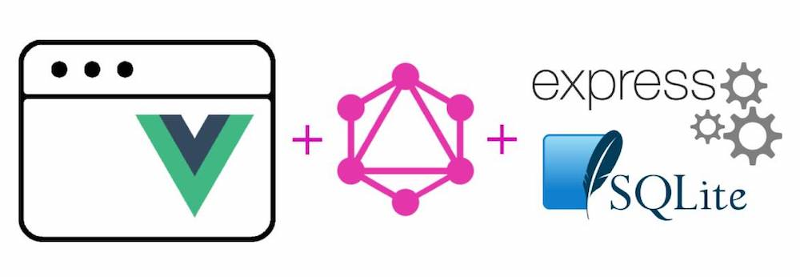

# GraphQL CRUD app demo 

## How to use

`npm run install && npm run start`

Open http://localhost:4000/graphql - to see the GraphiQL UI

Open http://localhost:8080/ - to see the frontend

## Backend

 - express.js
 - express-graphql
 - sql.js as DB

## Frontend

 - VueJS
 - vue-apollo + apollo-client